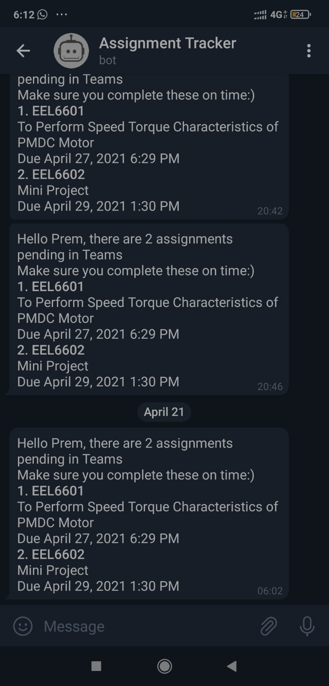

# Assignment-Tracker
A telegram bot, which tracks the pending assignments in Microsoft Teams and keep the user updated
# Dependencies
## **Selenium**
> open-source framework used to automate web browser
## **Pyrogram**
> Telegram client library framework to interact with telegram bots via the MTProto API
# Visuals

